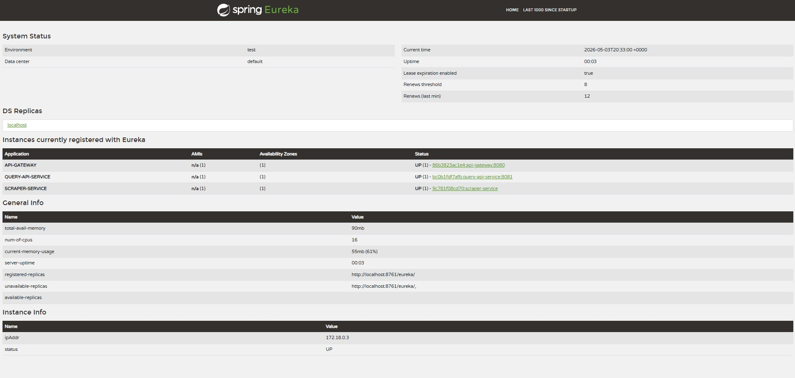

# StackPulse

A backend microservices system that scrapes software engineering job postings daily, extracts in-demand keywords from
job descriptions, and exposes the results through a REST API. Built to demonstrate production-oriented backend
engineering with Spring Boot and Spring Cloud.

---

## Architecture

StackPulse is composed of four services running as Docker containers and coordinated through Spring Cloud Netflix
Eureka.

```
[The Muse API]
      ↓
[Scraper Service] ──→ [PostgreSQL]
                              ↑
[Client] → [API Gateway] → [Query API Service]
                ↑
           [Eureka Server]
        (all services registered)
```

| Service               | Responsibility                                                                                                                      |
|-----------------------|-------------------------------------------------------------------------------------------------------------------------------------|
| **Scraper Service**   | Fetches job postings from The Muse API on a daily schedule, extracts keywords from descriptions, and persists results to PostgreSQL |
| **Query API Service** | Reads keyword frequency data from PostgreSQL and serves it via REST endpoints                                                       |
| **API Gateway**       | Single entry point — routes all client requests to the Query API and Scraper Service via Eureka service discovery                   |
| **Eureka Server**     | Service registry — all services register on startup; the gateway resolves addresses dynamically                                     |

### Tech Stack

- **Java 21** / **Spring Boot 3.4.4**
- **Spring Cloud** — Netflix Eureka, Spring Cloud Gateway
- **Spring Data JPA** / **Hibernate** — ORM layer
- **Flyway** — versioned database migrations
- **PostgreSQL 16** — persistent storage
- **OkHttp** / **jsoup** — HTTP client and HTML parsing for scraping
- **Docker Compose** — orchestrates the full system in a single command

---

## Eureka Dashboard

All three client services register with Eureka on startup and are visible in the dashboard at `http://localhost:8761`.



---

## API Reference

All requests go through the API Gateway on port `8080`.

### GET `/keywords/top`

Returns the most frequently appearing keywords across all scraped job postings.

**Query parameters:**

| Parameter | Type | Default  | Description                                                     |
|-----------|------|----------|-----------------------------------------------------------------|
| `limit`   | int  | 20       | Number of keywords to return                                    |
| `days`    | int  | *(none)* | If provided, filters to postings scraped within the last N days |

**Example request:**

```
GET http://localhost:8080/keywords/top?limit=5
```

**Example response:**

```json
[
  {
    "keyword": "java",
    "frequency": 142
  },
  {
    "keyword": "spring boot",
    "frequency": 118
  },
  {
    "keyword": "postgresql",
    "frequency": 97
  },
  {
    "keyword": "docker",
    "frequency": 84
  },
  {
    "keyword": "rest api",
    "frequency": 76
  }
]
```

---

### GET `/keywords/trending`

Returns keywords that have grown the most in frequency over a recent period compared to the prior equivalent period.

**Query parameters:**

| Parameter | Type | Default | Description                                                   |
|-----------|------|---------|---------------------------------------------------------------|
| `limit`   | int  | 20      | Number of keywords to return                                  |
| `days`    | int  | 30      | Defines the comparison window — recent N days vs prior N days |

**Example request:**

```
GET http://localhost:8080/keywords/trending?days=30&limit=5
```

**Example response:**

```json
[
  {
    "keyword": "kubernetes",
    "recentCount": 54,
    "priorCount": 21
  },
  {
    "keyword": "terraform",
    "recentCount": 38,
    "priorCount": 12
  },
  {
    "keyword": "grpc",
    "recentCount": 29,
    "priorCount": 8
  },
  {
    "keyword": "kafka",
    "recentCount": 41,
    "priorCount": 22
  },
  {
    "keyword": "rust",
    "recentCount": 17,
    "priorCount": 4
  }
]
```

---

### POST `/scraper/run`

Triggers an immediate scrape of The Muse API and persists any new job postings and keywords to the database. Useful for
populating the database on first startup without waiting for the scheduled 6:00 AM UTC run.

**Example request:**

```
POST http://localhost:8080/scraper/run
```

**Example response:**

```
Scrape completed successfully.
```

---

## Running Locally

### Prerequisites

- Docker Desktop
- A Muse API key — register for free at [themuse.com](https://www.themuse.com/developers/api/v2)

### Setup

**1. Clone the repository**

```bash
git clone https://github.com/riley-hendrickson/Stack-Pulse.git
cd Stack-Pulse
```

**2. Create your `.env` file**

```bash
cp .env.example .env
```

Open `.env` and add your Muse API key:

```
MUSE_API_KEY=your_key_here
```

**3. Build and start all services**

```bash
docker compose build
docker compose up
```

The full system takes about 15–20 seconds to come up. You can verify all services are registered by opening the Eureka
dashboard at `http://localhost:8761`.

**4. Populate the database**

The scraper runs on a daily schedule at 6:00 AM UTC. To populate the database immediately, wait until all services are
registered in the Eureka dashboard, then trigger a manual scrape:

```bash
curl -X POST http://localhost:8080/scraper/run
```

> **Note:** Allow 30–60 seconds after startup before triggering — the gateway needs time to sync its Eureka cache before
> it can route to the scraper service.

**5. Query the API**

```bash
curl http://localhost:8080/keywords/top?limit=10
```

### Stopping

```bash
docker compose down
```

To also wipe the database volume:

```bash
docker compose down -v
```

---

## Database Schema

Flyway manages all schema migrations. Migration files live in `scraper-service/src/main/resources/db/migration`.

```
known_keywords          — seed table of recognized technology keywords and aliases
job_postings            — one row per unique job posting fetched from the API
job_posting_keywords    — junction: which keywords appeared in which posting
```

Schema ownership belongs to the Scraper Service. The Query API has Flyway disabled and reads from the same database
without modifying the schema.

---

## Project Structure

```
Stack-Pulse/
├── docker-compose.yml
├── .env.example
├── eureka-server/
├── api-gateway/
├── scraper-service/
│   └── src/main/resources/db/migration/
└── query-api-service/
```