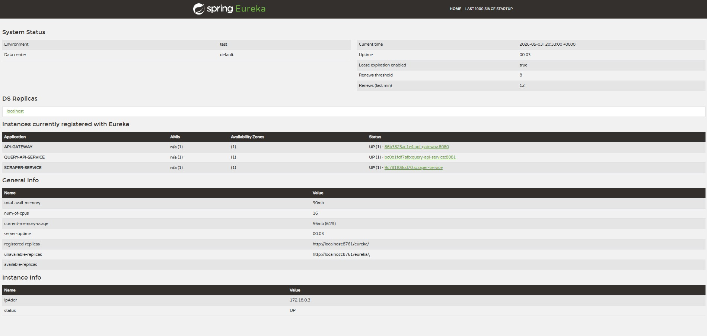

# StackPulse

A backend microservices system that scrapes software engineering job postings daily, extracts in-demand keywords from
job descriptions, and exposes the results through a REST API. Built to demonstrate production-oriented backend
engineering with Spring Boot and Spring Cloud.

---

## Live Demo

> Data is scraped daily at 6:00 AM UTC from [themuse.com](https://www.themuse.com/developers/api/v2).

**Top Keywords across all scraped postings:**
> [https://stack-pulse.up.railway.app/keywords/top](https://stack-pulse.up.railway.app/keywords/top)

**Trending Keywords over the past 30 days:**
> [https://stack-pulse.up.railway.app/keywords/trending](https://stack-pulse.up.railway.app/keywords/trending)

**Swagger UI (API docs):**
> [https://stack-pulse.up.railway.app/swagger-ui.html](https://stack-pulse.up.railway.app/swagger-ui.html)

---

## Architecture

StackPulse is composed of four Spring Boot services running as Docker containers, coordinated through Spring Cloud
Netflix Eureka, with Redis for caching and Kafka for event-driven cache invalidation.

```
[The Muse API]
      ↓
[Scraper Service] ──→ [PostgreSQL]
      ↓
   [Kafka] ──────────→ [Query API Service] ←──→ [Redis]
                              ↑
[Client] → [API Gateway] ────┘
                ↑
           [Eureka Server]
        (all services registered)
```

| Service               | Responsibility                                                                                                                                                               |
|-----------------------|------------------------------------------------------------------------------------------------------------------------------------------------------------------------------|
| **Scraper Service**   | Fetches job postings from The Muse API on a daily schedule, extracts keywords from descriptions, persists results to PostgreSQL, and publishes a Kafka event on completion   |
| **Query API Service** | Reads keyword frequency data from PostgreSQL, serves it via REST endpoints, caches results in Redis, and consumes Kafka events to invalidate the cache when new data arrives |
| **API Gateway**       | Single entry point — routes all client requests to the Query API and Scraper Service via Eureka service discovery; enforces per-IP rate limiting via Bucket4j                |
| **Eureka Server**     | Service registry — all services register on startup; the gateway resolves addresses dynamically                                                                              |

### Tech Stack

- **Java 21** / **Spring Boot 3.4.4**
- **Spring Cloud** — Netflix Eureka, Spring Cloud Gateway
- **Spring Data JPA** / **Hibernate** — ORM layer
- **Flyway** — versioned database migrations
- **PostgreSQL 16** — persistent storage
- **Redis** — response caching with 23-hour TTL and cache-aside pattern
- **Apache Kafka** (KRaft mode) — event-driven cache invalidation
- **Bucket4j** — per-IP rate limiting at the gateway layer
- **springdoc-openapi** — Swagger/OpenAPI documentation, routed through the gateway
- **OkHttp** / **jsoup** — HTTP client and HTML parsing for scraping
- **Docker Compose** — orchestrates the full system in a single command
- **Railway** — hosted on Railway with private networking between services

---

## Key Design Decisions

**Cache-aside with Redis** — Query API results are stored in Redis with a 23-hour TTL using `RedisTemplate` directly
(rather than `@Cacheable`) to keep the caching logic visible and portfolio-readable. Keys follow the pattern
`keywords:{type}:days:{n}:limit:{n}`.

**Event-driven cache invalidation via Kafka** — Rather than waiting for TTL expiry, the Scraper Service publishes a
`ScrapeCompletedEvent` to the `scrape-completed` Kafka topic after each successful scrape. The Query API Service
consumes this event and evicts all `keywords:*` Redis keys immediately, ensuring the cache always reflects the latest
data within seconds of a scrape completing.

**Per-IP rate limiting** — The API Gateway enforces rate limits using Bucket4j backed by Redis, extracting the real
client IP from `X-Forwarded-For` headers.

---

## Eureka Dashboard

All three client services register with Eureka on startup.



---

## API Reference

All requests go through the API Gateway via `https://stack-pulse.up.railway.app`. Interactive docs are available at
`/swagger-ui.html`.

### GET `/keywords/top`

Returns the most frequently appearing keywords across all scraped job postings (the value for each keyword is the
number of job postings that keyword appears in).

**Query parameters:**

| Parameter | Type | Default  | Description                                                     |
|-----------|------|----------|-----------------------------------------------------------------|
| `limit`   | int  | 20       | Number of keywords to return                                    |
| `days`    | int  | *(none)* | If provided, filters to postings scraped within the last N days |

**Example request:**

```
GET https://stack-pulse.up.railway.app/keywords/top?limit=5
```

**Example response:**

```json
[
  {
    "keyword": "java",
    "frequency": 142
  },
  {
    "keyword": "spring boot",
    "frequency": 118
  },
  {
    "keyword": "postgresql",
    "frequency": 97
  },
  {
    "keyword": "docker",
    "frequency": 84
  },
  {
    "keyword": "rest api",
    "frequency": 76
  }
]
```

---

### GET `/keywords/trending`

Returns keywords that have grown the most in frequency over a recent period compared to the prior equivalent period.

**Query parameters:**

| Parameter | Type | Default | Description                                                   |
|-----------|------|---------|---------------------------------------------------------------|
| `limit`   | int  | 20      | Number of keywords to return                                  |
| `days`    | int  | 30      | Defines the comparison window — recent N days vs prior N days |

**Example request:**

```
GET https://stack-pulse.up.railway.app/keywords/trending?days=30&limit=5
```

**Example response:**

```json
[
  {
    "keyword": "kubernetes",
    "recentCount": 54,
    "priorCount": 21
  },
  {
    "keyword": "terraform",
    "recentCount": 38,
    "priorCount": 12
  },
  {
    "keyword": "grpc",
    "recentCount": 29,
    "priorCount": 8
  },
  {
    "keyword": "kafka",
    "recentCount": 41,
    "priorCount": 22
  },
  {
    "keyword": "rust",
    "recentCount": 17,
    "priorCount": 4
  }
]
```

---

## Running Locally

### Prerequisites

- Docker Desktop
- A Muse API key — register for free at [themuse.com](https://www.themuse.com/developers/api/v2)

### Setup

**1. Clone the repository**

```bash
git clone https://github.com/riley-hendrickson/Stack-Pulse.git
cd Stack-Pulse
```

**2. Create your `.env` file**

```bash
cp .env.example .env
```

Open `.env` and add your Muse API key:

```
MUSE_API_KEY=your_key_here
```

**3. Build and start all services**

```bash
docker compose build
docker compose up
```

The full system takes about 15–20 seconds to come up. You can verify all services are registered by opening the Eureka
dashboard at `http://localhost:8761`. Swagger UI is available at `http://localhost:8080/swagger-ui.html`.

**4. Populate the database**

The scraper runs on a daily schedule at 6:00 AM UTC. To populate the database immediately, wait until all services are
registered in the Eureka dashboard, then trigger a manual scrape:

```bash
curl -X POST http://localhost:8080/scraper/run
```

> **Note:** Allow 30–60 seconds after startup before triggering — the gateway needs time to sync its Eureka cache
> before it can route to the scraper service. The scrape also publishes a Kafka event on completion, which the Query
> API Service consumes to evict its Redis cache automatically.

**5. Query the API**

```bash
curl http://localhost:8080/keywords/top?limit=10
```

### Stopping

```bash
docker compose down
```

To also wipe the database volume:

```bash
docker compose down -v
```

---

## Database Schema

Flyway manages all schema migrations. Migration files live in `scraper-service/src/main/resources/db/migration`.

```
known_keywords          — seed table of recognized technology keywords and aliases
job_postings            — one row per unique job posting fetched from the API
job_posting_keywords    — junction: which keywords appeared in which posting
```

Schema ownership belongs to the Scraper Service. The Query API has Flyway disabled and reads from the same database
without modifying the schema.

---

## Project Structure

```
Stack-Pulse/
├── docker-compose.yml
├── .env.example
├── eureka-server/
├── api-gateway/
├── scraper-service/
│   └── src/main/resources/db/migration/
└── query-api-service/
```